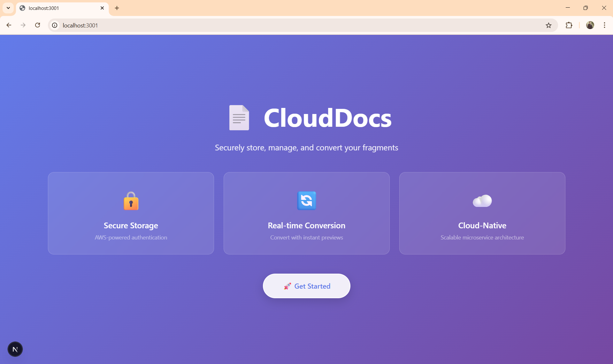
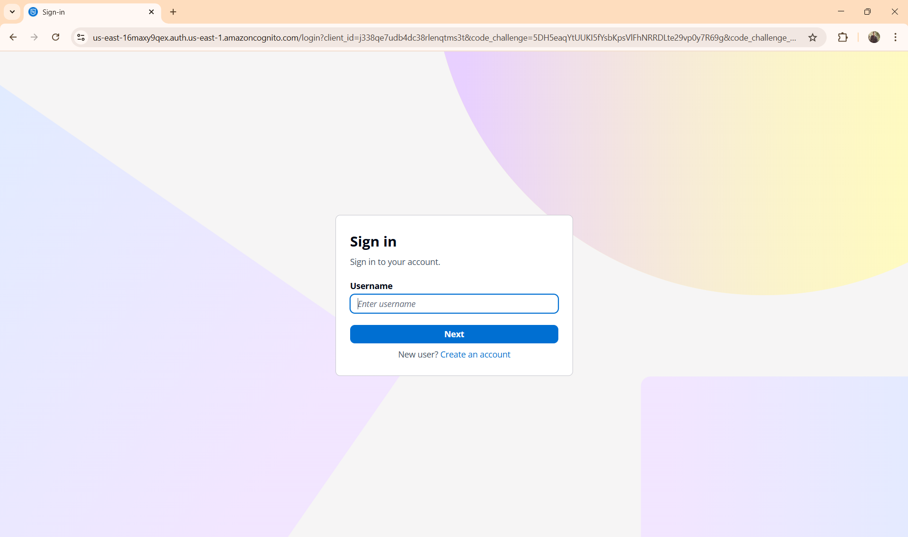
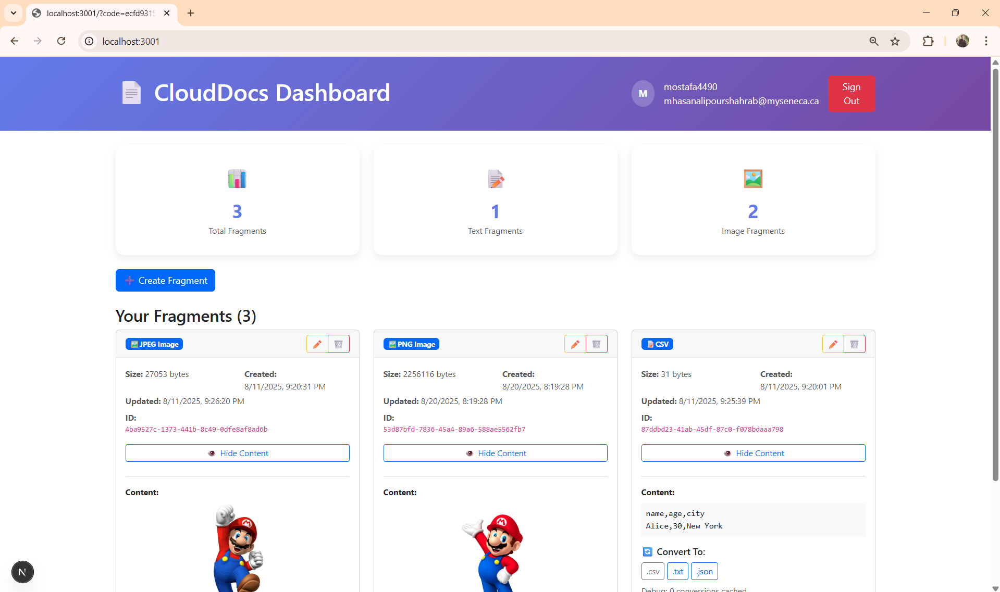
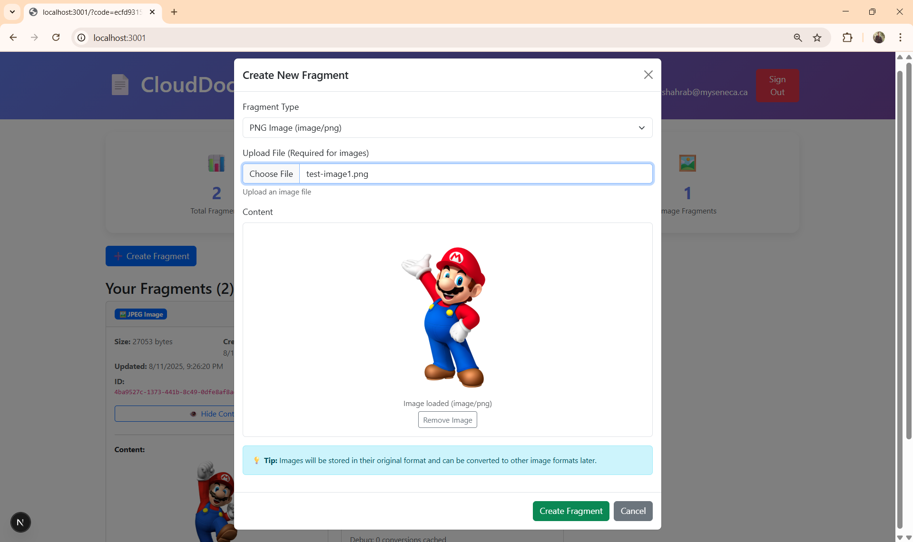
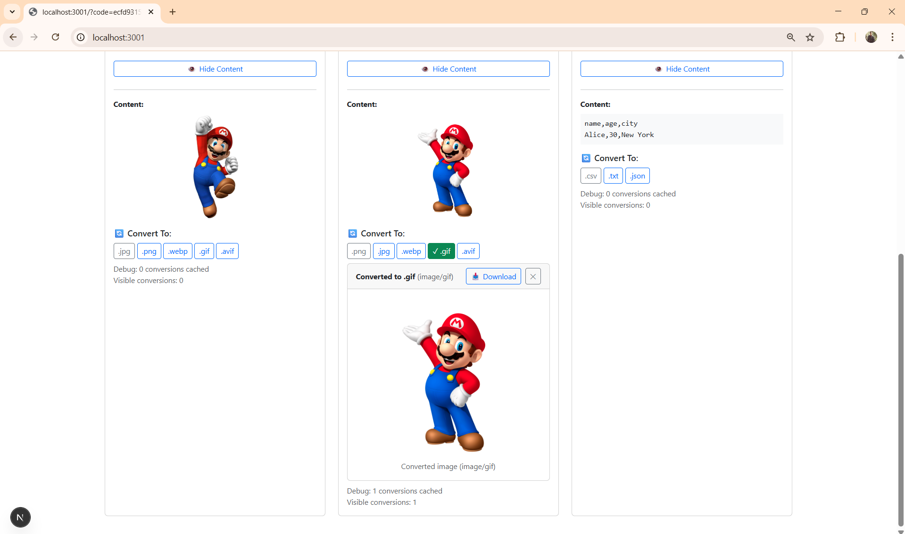

# CloudDocs - UI

A modern **React + Next.js** frontend for securely managing, converting, and interacting with the Fragments microservice using **Amazon Cognito** authentication and **OIDC (OpenID Connect)**.

---

## 🌟 Features

### 🔐 Secure Authentication

- **AWS Cognito Integration**: Enterprise-grade authentication with OIDC
- **Authorization Code Flow with PKCE**: Industry-standard security implementation
- **Seamless Login/Logout**: Hosted UI for user management

### 📄 Fragment Management

- **Create Fragments**: Support for multiple content types (text, data, images)
- **View & Edit**: Real-time content editing with validation
- **Delete Operations**: Secure fragment removal with confirmations
- **Smart Upload**: Auto-detection of file types and content validation

### 🔄 Real-time Conversion

- **Multi-format Support**: Convert between compatible formats instantly
- **Live Previews**: See converted content before downloading
- **Image Processing**: Convert between PNG, JPEG, WebP, GIF, AVIF formats
- **Text Transformations**: Markdown to HTML, CSV to JSON, JSON to YAML

### 📊 Professional Dashboard

- **Usage Statistics**: Track fragments by type and count
- **User Management**: Display authenticated user information
- **Responsive Design**: Modern, mobile-friendly interface
- **Visual Feedback**: Loading states and error handling

### 🎨 Modern UI/UX

- **Bootstrap Integration**: Professional styling and components
- **Modular CSS**: Custom styling with CSS modules
- **Interactive Elements**: Hover effects and smooth transitions
- **Accessibility**: Semantic markup and keyboard navigation

---

## 📸 Screenshots

**Landing Page**  


**AWS Cognito Sign In Page**  


**Home Page Displaying Fragments Stored in AWS S3**  


**Creating New Fragment**  


**Fragment Conversion between formats**  


---

## 🛠️ Technical Stack

- **Framework**: Next.js 15.3.2 with React 19.0.0
- **Authentication**: AWS Cognito with oidc-client-ts 3.2.1
- **Styling**: Bootstrap 5.3.6 + Custom CSS Modules
- **Build Tool**: Next.js built-in bundling and optimization
- **Container**: Docker with multi-stage builds for production

---

## 📁 Project Architecture

```
/src
├── pages/
│   ├── index.js                    # Main application entry point
│   ├── _app.js                     # Global app configuration
│   ├── _document.js                # HTML document structure
│   └── api/hello.js                # Next.js API route example
├── components/
│   ├── Dashboard.js                # Main dashboard layout
│   ├── LandingPage.js              # Unauthenticated user landing
│   ├── LoginButton.js              # Authentication trigger
│   ├── SignOutButton.js            # Logout functionality
│   ├── CreateFragmentForm.js       # Fragment creation modal
│   ├── EditFragmentForm.js         # Fragment editing interface
│   ├── FragmentList.js             # Fragment display and management
│   ├── FragmentConverter.js        # Format conversion controls
│   ├── StatsCard.js                # Dashboard statistics
│   └── FeatureCard.js              # Landing page features
├── styles/
│   ├── globals.css                 # Global styles
│   ├── Dashboard.module.css        # Dashboard-specific styles
│   ├── LandingPage.module.css      # Landing page styles
│   ├── LoginButton.module.css      # Login button styles
│   └── FeatureCard.module.css      # Feature card styles
├── auth.js                         # Cognito authentication logic
└── api.js                          # Backend API communication
```

---

## 🚀 Getting Started

### Prerequisites

- **Node.js**: Version 22.12.0 or later
- **npm**: Latest version
- **AWS Cognito**: Configured user pool and client
- **Fragments Backend**: Running microservice instance

### 1. Environment Configuration

Create a `.env.local` file in the root directory:

```env
# AWS Cognito Configuration
NEXT_PUBLIC_AWS_COGNITO_POOL_ID=us-east-1_abc123def
NEXT_PUBLIC_AWS_COGNITO_CLIENT_ID=1a2b3c4d5e6f7g8h9i0j
NEXT_PUBLIC_COGNITO_DOMAIN=your-domain.auth.us-east-1.amazoncognito.com
NEXT_PUBLIC_OAUTH_SIGN_IN_REDIRECT_URL=http://localhost:3000

# Backend API Configuration
NEXT_PUBLIC_API_URL=http://localhost:8080
```

### 2. Installation & Development

```bash
# Clone the repository
git clone https://github.com/most4f4/fragments-ui.git
cd fragments-ui

# Install dependencies
npm install

# Start development server
npm run dev

# Open browser
open http://localhost:3000
```

### 3. Production Build

```bash
# Build for production
npm run build

# Start production server
npm start
```

---

## 🐳 Docker Deployment

### Multi-stage Docker Build

```bash
# Build the Docker image with build arguments
docker build \
  --build-arg NEXT_PUBLIC_API_URL=https://api.yourdomain.com \
  --build-arg NEXT_PUBLIC_AWS_COGNITO_POOL_ID=us-east-1_abc123 \
  --build-arg NEXT_PUBLIC_AWS_COGNITO_CLIENT_ID=xyz456 \
  --build-arg NEXT_PUBLIC_OAUTH_SIGN_IN_REDIRECT_URL=https://yourdomain.com \
  --build-arg NEXT_PUBLIC_COGNITO_DOMAIN=yourdomain.auth.us-east-1.amazoncognito.com \
  -t fragments-ui .

# Run the container
docker run -p 3000:3000 fragments-ui
```

### Docker Features

- **Multi-stage builds**: Optimized production images
- **Build-time configuration**: Environment variables baked into build
- **Slim runtime**: Node.js slim base for reduced image size
- **Security**: Non-root user execution

---

## 🔐 Authentication Flow

### OIDC Implementation

1. **User clicks login** → Redirected to Cognito Hosted UI
2. **User authenticates** → Cognito returns authorization code
3. **Code exchange** → Application exchanges code for tokens
4. **Secure requests** → All API calls include Bearer token

### Token Management

```javascript
// Example authenticated request
const response = await fetch(`${API_URL}/v1/fragments`, {
  headers: user.authorizationHeaders(),
});
```

---

## 📝 Supported Fragment Types

### Text Formats

- **Plain Text** (`text/plain`)
- **Markdown** (`text/markdown`) → HTML conversion
- **HTML** (`text/html`) → Plain text extraction
- **CSV** (`text/csv`) → JSON conversion

### Data Formats

- **JSON** (`application/json`) → YAML conversion
- **YAML** (`application/yaml`) → Plain text

### Image Formats

- **PNG** (`image/png`)
- **JPEG** (`image/jpeg`)
- **WebP** (`image/webp`)
- **GIF** (`image/gif`)
- **AVIF** (`image/avif`)

### Conversion Matrix

| From      | To               | Notes                |
| --------- | ---------------- | -------------------- |
| Markdown  | HTML, Plain Text | Live rendering       |
| CSV       | JSON, Plain Text | Structured parsing   |
| JSON      | YAML, Plain Text | Pretty formatting    |
| Any Image | Any Image        | Cross-format support |

---

## 🎯 Key Features Deep Dive

### Fragment Creation

- **Smart Upload**: Automatic content type detection
- **Validation**: Real-time content validation and feedback
- **Preview**: Live preview for supported formats
- **Error Handling**: Comprehensive error messages and recovery

### Fragment Management

- **CRUD Operations**: Complete create, read, update, delete functionality
- **Batch Operations**: Multiple fragment selection and management
- **Search & Filter**: Find fragments by type, content, or metadata
- **Sorting**: Organize by creation date, size, or type

### Conversion Engine

- **On-demand Conversion**: Convert without affecting original
- **Caching**: Client-side caching of converted content
- **Download Support**: Direct download of converted formats
- **Error Recovery**: Graceful handling of conversion failures

### User Experience

- **Responsive Design**: Mobile-first responsive layout
- **Loading States**: Visual feedback for all operations
- **Error Boundaries**: Graceful error handling and recovery
- **Accessibility**: WCAG 2.1 compliant interface

---

## 🧪 API Integration

### Core Endpoints

```javascript
// Get all fragments
GET /v1/fragments?expand=1

// Create fragment
POST /v1/fragments
Content-Type: text/markdown
Body: "# Hello World"

// Get fragment data
GET /v1/fragments/:id

// Convert fragment
GET /v1/fragments/:id.html

// Update fragment
PUT /v1/fragments/:id
Content-Type: text/markdown
Body: "# Updated Content"

// Delete fragment
DELETE /v1/fragments/:id
```

### Error Handling

- **Network Errors**: Automatic retry with exponential backoff
- **Authentication**: Token refresh and re-authentication
- **Validation**: Client-side and server-side validation
- **User Feedback**: Clear error messages and recovery options

---

## 🔧 Development Tools

### Code Quality

- **ESLint**: Code linting with Next.js configuration
- **Prettier**: Code formatting (can be added)
- **TypeScript**: Can be migrated for type safety

### Build Optimization

- **Tree Shaking**: Automatic dead code elimination
- **Code Splitting**: Automatic route-based splitting
- **Image Optimization**: Built-in Next.js image optimization
- **Bundle Analysis**: npm run build provides bundle insights

---

## 🌐 Production Considerations

### Performance

- **Server-Side Rendering**: Next.js SSR for faster initial loads
- **Static Generation**: Pre-built pages where applicable
- **CDN Ready**: Optimized for content delivery networks
- **Caching**: Proper cache headers and strategies

### Security

- **HTTPS Enforcement**: Production requires HTTPS
- **CORS Configuration**: Proper cross-origin setup
- **Token Security**: Secure token storage and transmission
- **Content Security Policy**: CSP headers for XSS protection

### Monitoring

- **Error Tracking**: Integration-ready for Sentry, LogRocket
- **Analytics**: Google Analytics or similar integration
- **Performance**: Web Vitals monitoring
- **Uptime**: Health check endpoints

---

## 🤝 Contributing

### Development Workflow

1. **Fork** the repository
2. **Create** feature branch (`git checkout -b feature/amazing-feature`)
3. **Commit** changes (`git commit -m 'Add amazing feature'`)
4. **Push** to branch (`git push origin feature/amazing-feature`)
5. **Open** Pull Request

### Code Standards

- Follow ESLint configuration
- Use semantic commit messages
- Add JSDoc comments for complex functions
- Update README for new features

---

## 📄 License

This project is **UNLICENSED** and developed for educational purposes.

---

## 🆘 Support

### Documentation

- **Next.js**: [nextjs.org/docs](https://nextjs.org/docs)
- **AWS Cognito**: [docs.aws.amazon.com/cognito](https://docs.aws.amazon.com/cognito/)
- **Bootstrap**: [getbootstrap.com](https://getbootstrap.com)

### Troubleshooting

- **Authentication Issues**: Check Cognito configuration and redirect URLs
- **CORS Errors**: Verify backend CORS settings
- **Build Failures**: Check Node.js version and dependencies
- **Environment Variables**: Ensure all required variables are set

---

**Built with ❤️ using React, Next.js, and AWS Cognito**
